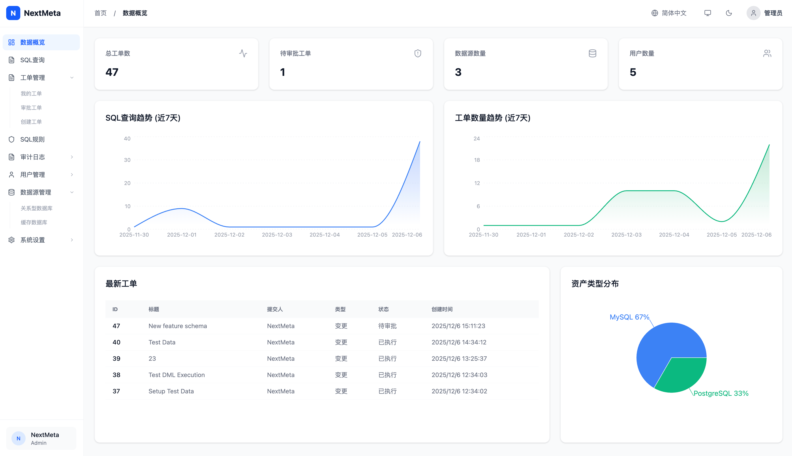

<h1 style="border-bottom: none">
  <b>NextMeta</b> 
</h1>

  一款轻量级、简约风的数据库 SQL 审核平台，聚焦安全防护与性能优化，为团队提供统一的查询入口、工单审批和审计追踪能力。

---

[简体中文] <!-- 待补充：其他语言文档链接，如英文 / 日文等 -->

## ✨ 功能概览

- **安全 SQL 查询工作台**: 支持多数据源切换、SQL 语法高亮、相对表名书写、双击表快速预览前 20 行、结果导出以及库表级容量统计。
- **SQL 审计与规则引擎**: 集成规则引擎，对 SQL 进行语法与风险检查，可配置阻断 / 警告级规则，并在审计日志中记录触发详情。
- **工单流转与审批**: 支持查询 / 变更 / 导出工单，内置审批流、Explain 预检、风险确认与执行结果归档。
- **团队与权限 (RBAC + LDAP)**: 基于组 (Group) 的数据源访问与审批权限管控，支持 LDAP 组自动继承，显著减少手工授权成本。
- **数据脱敏与安全控制**: 按数据源维度配置字段脱敏规则（AST 血缘分析等），配合全局 LIMIT、执行超时与 Explain 阈值，从多维度防止拖垮数据库。
- **系统设置与通知**: 集中配置全局限制、安全阈值及模版化 Webhook 通知，方便接入企业自有告警 / 通知渠道。
- **待补充**: 截图与 Demo 链接（Dashboard、SQL 查询、工单详情、审计日志等页面）。

## 📘 使用文档

- **功能详情与页面截图**：查看完整的功能模块说明与 UI 截图，覆盖 SQL 查询、工单管理、审计日志、系统设置等核心能力。  
  👉 [点击查看更多详情](./docs/功能说明.md)

- **部署与运维指南**：使用 Docker Compose 一键启动 NextMeta，包含配置说明、启动步骤和常用运维命令。  
  👉 [查看部署指南](./docs/部署指南.md)

## 📦 许可证与联系方式

- 待补充：产品主页 / 文档网站链接。

> 扫码添加微信，加入 NextMeta 交流群（产品更新、问题反馈与使用交流）：

