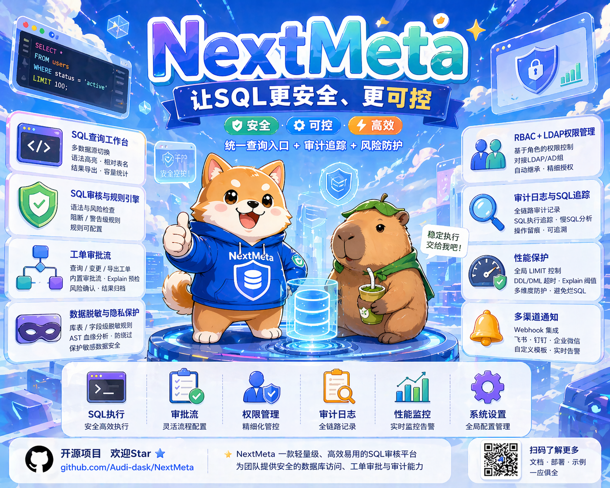

<div align="center">

<h1 style="border-bottom: none">
  <b>NextMeta</b><br />
</h1>

<p>
  一款轻量级、简约风的数据库 SQL 审核平台，聚焦安全防护与性能优化，为团队提供统一的查询入口、工单审批和审计追踪能力。
</p>

<p>
  👉 <a href="https://audi-dask.github.io/NextMeta/">官方文档站</a> ｜ <a href="https://audi-dask.github.io/NextMeta/%E9%83%A8%E7%BD%B2%E6%8C%87%E5%8D%97.html">部署指南</a> ｜ <a href="https://audi-dask.github.io/NextMeta/%E5%8A%9F%E8%83%BD%E8%AF%B4%E6%98%8E.html">功能说明</a>
</p>

</div>



## 一键安装

```bash
curl -fsSL https://raw.githubusercontent.com/Audi-dask/NextMeta/main/install.sh | bash
```

启动后访问 `http://localhost:8080`，默认管理员 `NextMeta / password123`（登录后请立即修改）。

## 路线图

### 阶段一：查询 + 静态审核

### 阶段一：查询 + 静态审核

- [x] 接入 PG 驱动（PG 方言 SQL 解析器未做，仍用前缀轻量判断）
- [x] 数据源支持「类型」与「连接 database」字段，DSN / 连接按类型分流
- [x] 元数据采集适配 PG（schema 列表、字段、主键）
- [ ] SQL 解析与语句识别适配 PG（SELECT 判断已做，LIMIT 注入未做）
- [ ] 静态审核规则拆分为通用 / MySQL / PG 三套，按类型启用（PG 审核当前空放行）
- [x] 前端对齐：编辑器方言、库表树、数据源类型选择、路由菜单（仅私有版，开源不同步）
- [ ] 查询链路端到端验证

### 阶段二：工单 + 动态审核 + EXPLAIN + 脱敏

- [ ] 动态审核规则 + 元数据采集适配 PG（元数据 pg_catalog 已做，动态审核未做）
- [x] EXPLAIN 适配（PG `EXPLAIN (FORMAT JSON)`）
- [ ] 超时（`statement_timeout`）与错误码（SQLSTATE）适配（statement_timeout 已做，SQLSTATE 未做）
- [ ] 脱敏血缘适配 PG AST（仅按返回列名兜底匹配）
- [ ] DDL/DML 工单全流程验证（PG 工单审核空放行）
- [ ] 测试与文档同步（文档已做，测试未做）
## 免责声明

> 由 NextMeta 以及其他第三方二次开发所产生的一切后果，NextMeta 作者本人不负一切责任！

请在进行安全评估及测试体验后使用。
