## 功能说明大纲

> 下文为 NextMeta 的主要功能模块与对应页面截图，建议配合线上 Demo 一起查看体验。

### 1. 仪表盘 (Dashboard)
- **系统概览**: 实时展示工单统计、数据源数量、用户数量等关键指标。
- **活跃统计**: 展示近期 SQL 查询与工单趋势（后续可扩展更丰富的图表）。

### 2. SQL 查询 (SQL Query)
- **在线查询**: 支持多数据源切换，提供 SQL 编辑器（语法高亮），选定数据库后可直接使用相对表名编写 SQL（免写库名前缀）。
- **执行控制**: 从多个维度进行性能控制，防止拖垮数据库、以及孤儿SQL的出现。
- **结果展示**: 表格化展示查询结果，支持大数据量分页与结果导出（CSV / JSON）。
- **个人片段**: 支持个人 SQL 片段的保存与复用，便于沉淀常用查询。
- **容量统计**: 支持库表级别的容量与行数统计展示，辅助评估数据规模与查询成本。
- **快捷预览**: 支持在库表树中双击表名，一键生成并执行快速查询（默认预览前 20 行数据）。

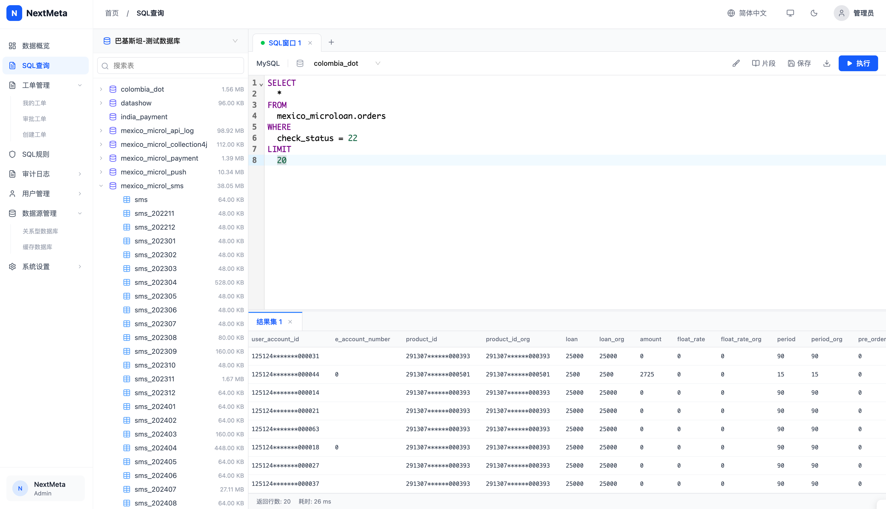

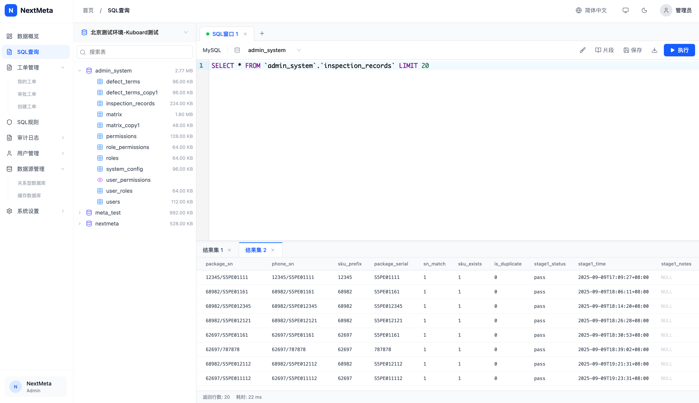

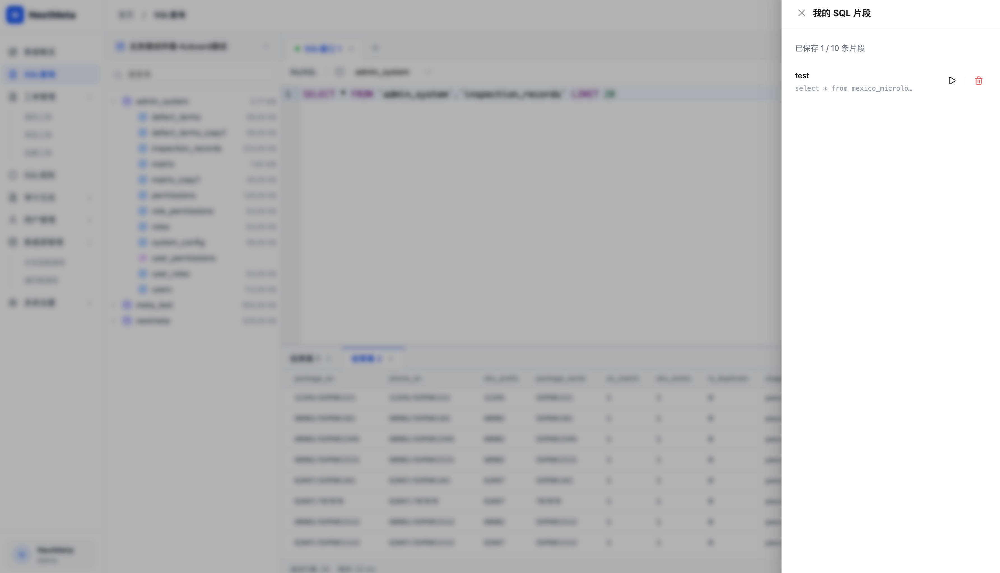

### 3. 工单管理 (Ticket Management)
- **工单申请**: 支持查询、变更、导出等多种工单类型。
- **语法检查**: 提交前自动进行 SQL 语法预检 (Explain)，提前发现错误、以及性能消耗。
- **强制提交**: 针对高危操作（如无 WHERE 条件），支持风险确认后的强制提交（可变更规则强制阻断强制提交）。
- **审批流程**: 基于组的审批流，支持查看提交人和当前审核人。

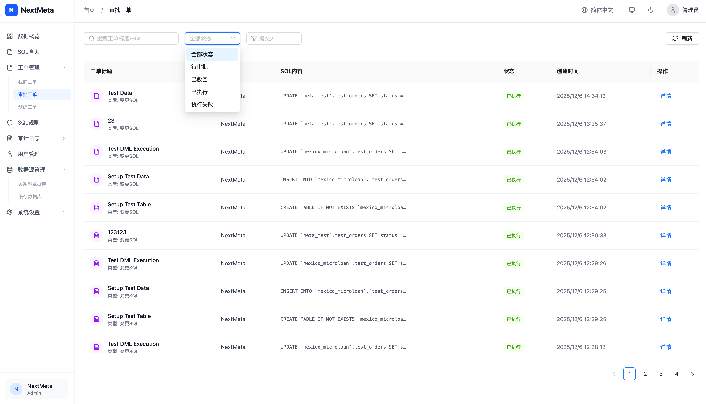

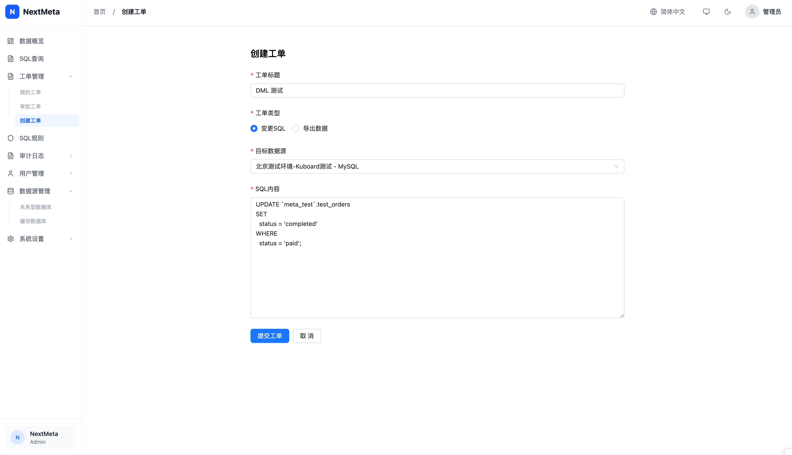

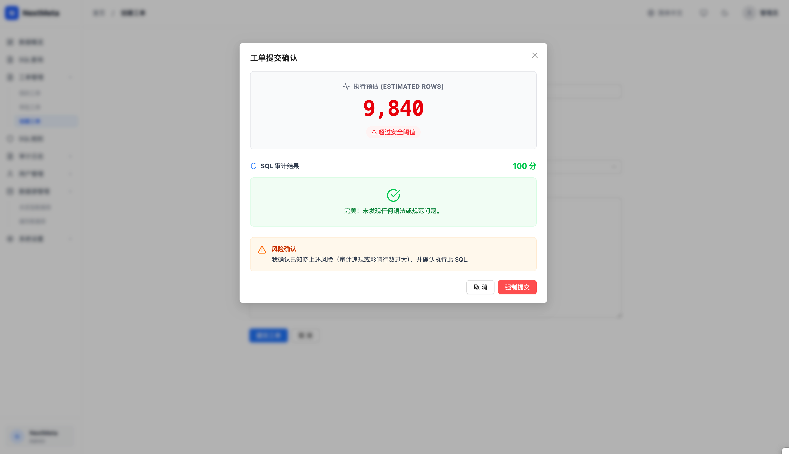

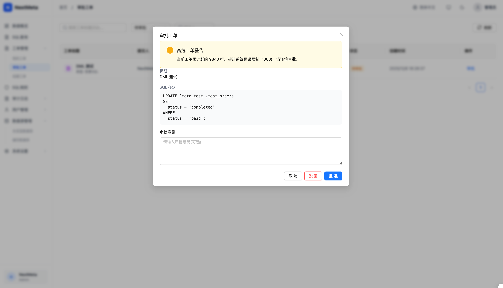

### 4. 团队与权限 (Team & Permission)
- **团队管理**: 创建和管理团队，分配团队成员。
- **用户管理**: 本地用户管理及 LDAP 用户同步（支持自定义属性映射）。
- **分组授权**: 基于组 (Group) 管理数据源访问权限和审批权限，细粒度控制谁能访问哪些数据源、谁能审批哪些工单。
- **LDAP继承**: 自动继承 LDAP 组与人员关联，默认沿用组织架构关系减少手工授权配置工作量。

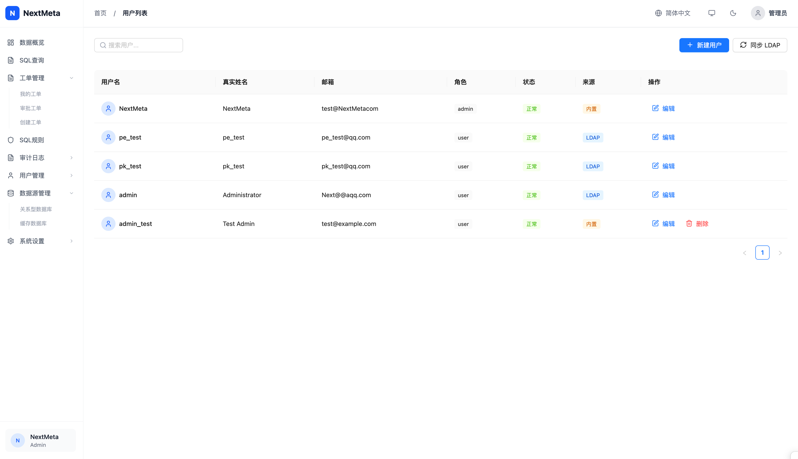

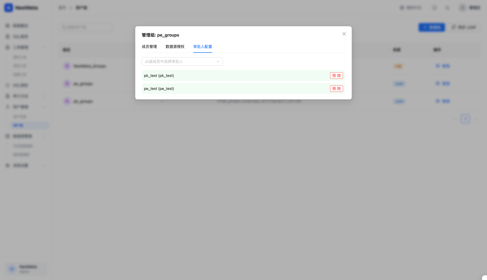

### 5. SQL 审计规则 (SQL Rules)
- **规则配置**: 可视化配置审计规则（启用/禁用），支持规则引擎联动。
- **级别调整**: 支持自定义规则级别（阻断 / 警告）和描述文案。
- **规则解释**: 提供详细的规则说明与正反例 SQL 示例 (Tooltip)，帮助开发理解触发原因。

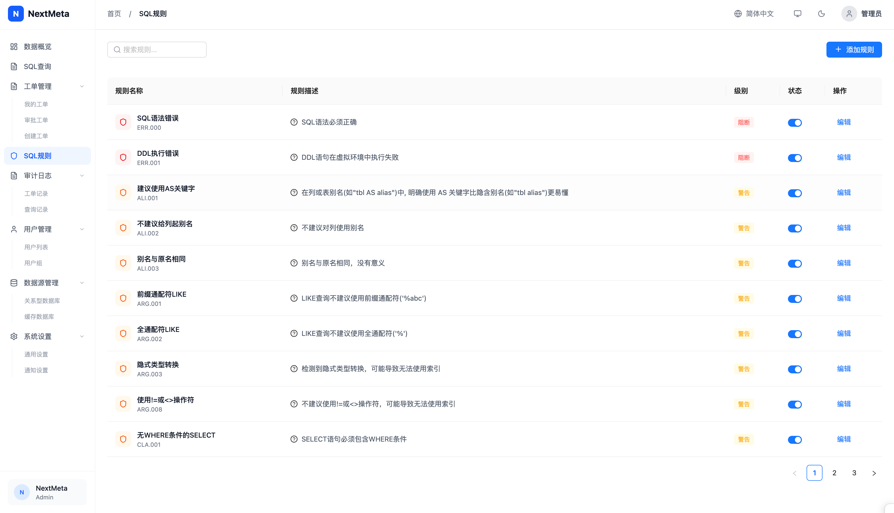

### 6. 审计日志 (Audit Logs)
- **全量记录**: 记录所有 SQL 执行操作，包括工单执行和SQL查询记录。
- **详情追溯**: 可查看具体的 SQL 内容、执行人、触发规则、执行时间及状态。

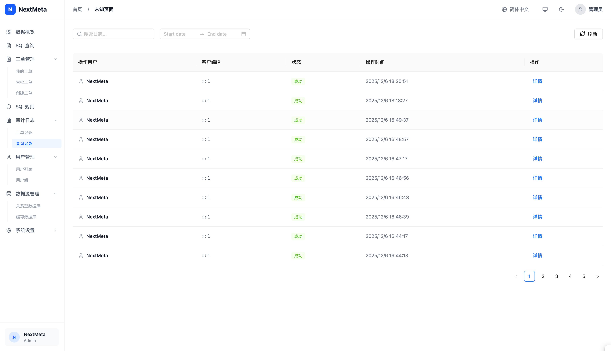

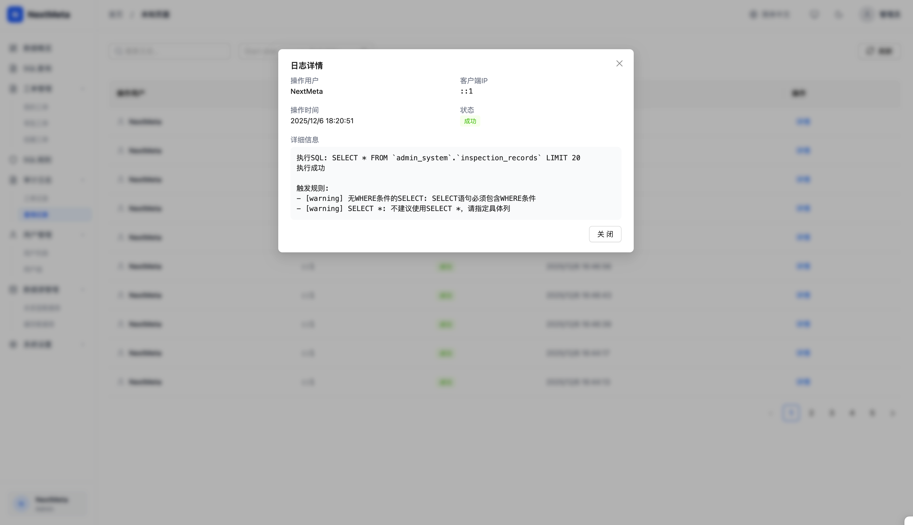

### 7. 数据源管理 (Data Sources)
- **连接管理**: 支持 MySQL 等数据库的连接配置与测试。
- **分组归类**: 按项目 / 团队为数据源分组，便于管理与授权。
- **安全配置**: 支持设置最大执行时间、字段脱敏规则等安全参数。

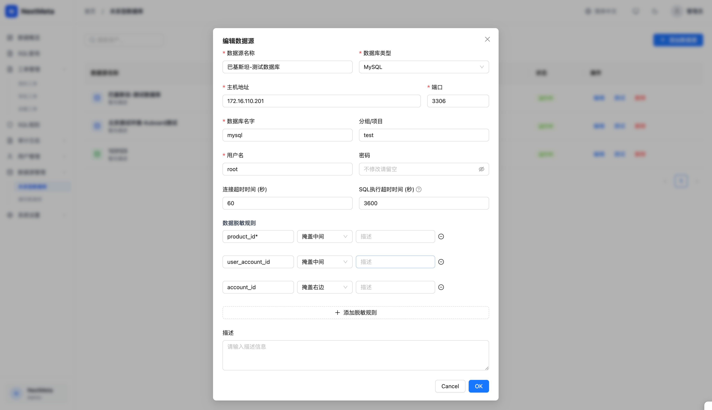

### 8. 系统设置 (System Settings)
- **全局限制**: 配置全局 SQL 查询行数限制 (Global LIMIT)，统一收敛大查询风险。
- **安全阈值**: 配置工单影响行数阈值，用于 Explain 预估超限提醒与二次确认。
- **基础选项**: 管理平台级通用参数（如部分安全开关、默认超时等）。
- **模版化通知**: 支持按事件配置 Webhook 地址与消息模版，便于接入企业自有通知与告警渠道。

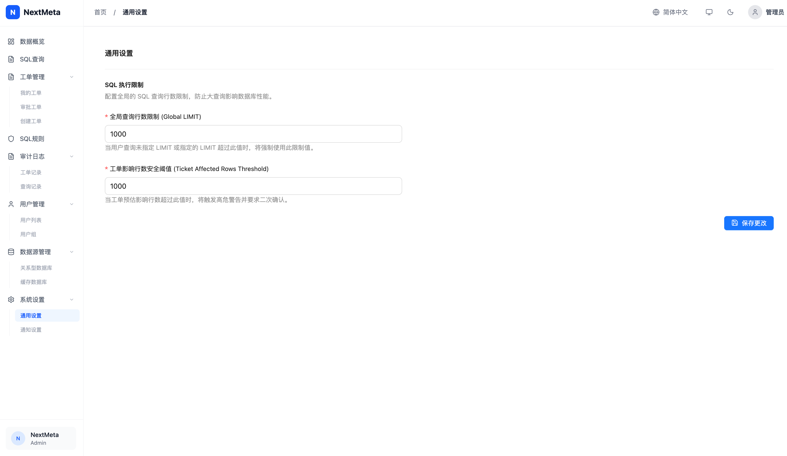

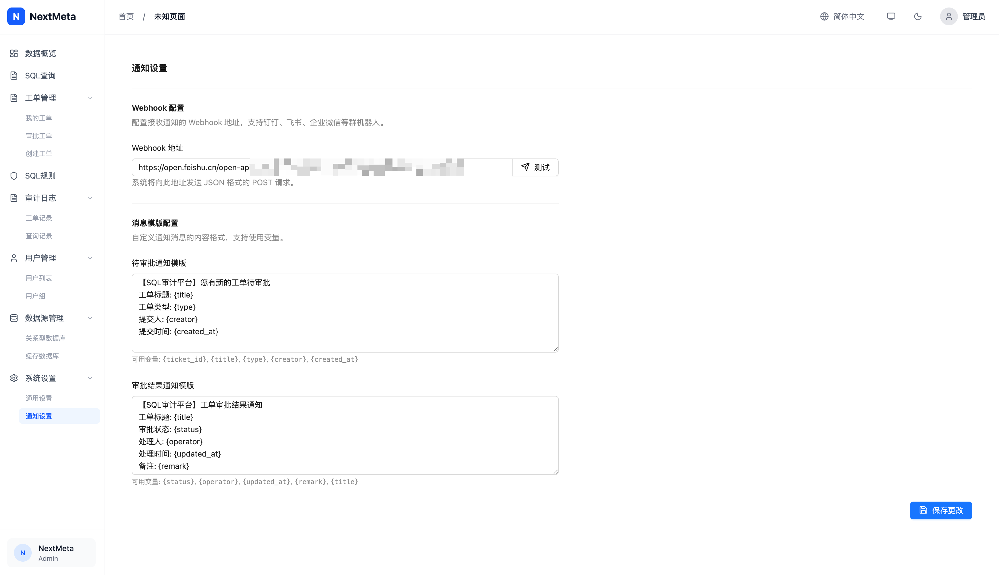

---

## 🔖 自动 SQL 检查与规则引擎

NextMeta 内置自动 SQL 检查能力，通过规则引擎对工单和在线 SQL 进行扫描：

- **语法与执行计划检查**: 在工单创建或预检阶段执行 Explain，评估预计影响行数与执行代价。
- **安全规则**: 对高危操作（如 `DROP DATABASE/TABLE`、大面积无 WHERE 的 DML）进行阻断或强提醒。
- **规则可配置**: 通过「SQL 审计规则」页面调整启用状态、严重级别与文案，满足不同环境的合规要求。

---

## 💡 SQL 编辑体验

- **语法高亮**: 基于 Web 编辑器提供 SQL 语法高亮。
- **表结构导航**: 左侧库表树展示数据库结构，支持搜索表名。
- **智能插入**: 双击表名生成示例查询，并自动补全库名前缀（或使用相对表名）。

> 后续将补充：编辑器快捷键、自动补全细节说明与更多截图。

---

## ⏺️ 工单与查询记录

- **工单记录**: 完整保留每一次 SQL 工单的生命周期，包括申请、审批、执行结果与回溯信息。
- **查询审计**: 在线 SQL 执行也会记入审计日志，方便后续追踪谁在何时查了哪些数据。
- **导出留痕**: 导出类工单在审批与下载阶段都有记录，便于满足合规要求。

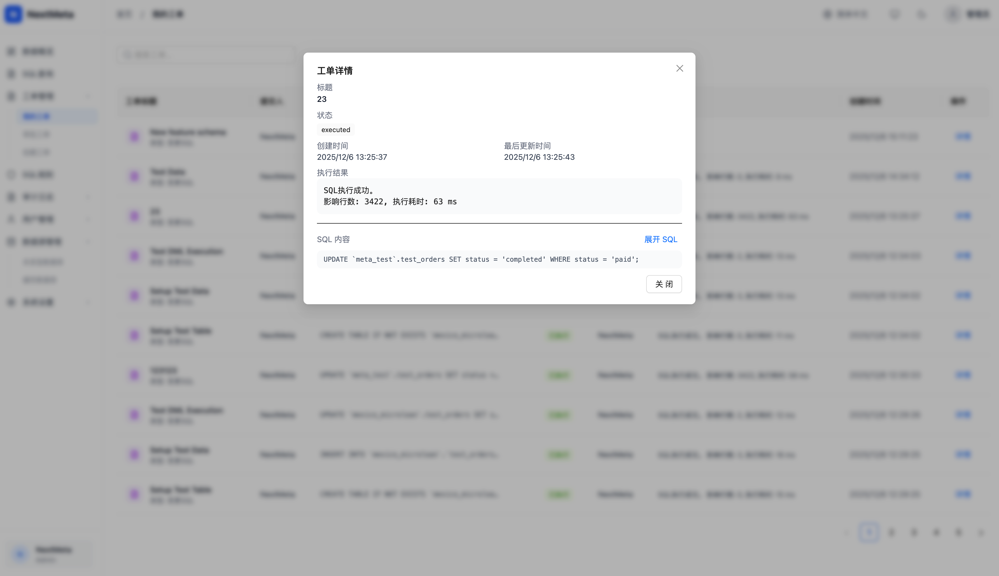

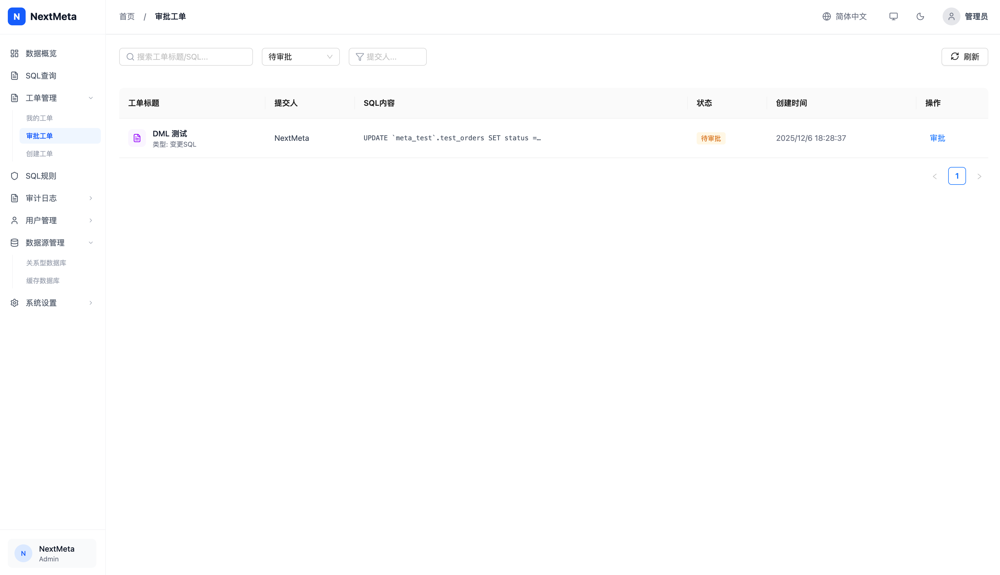

